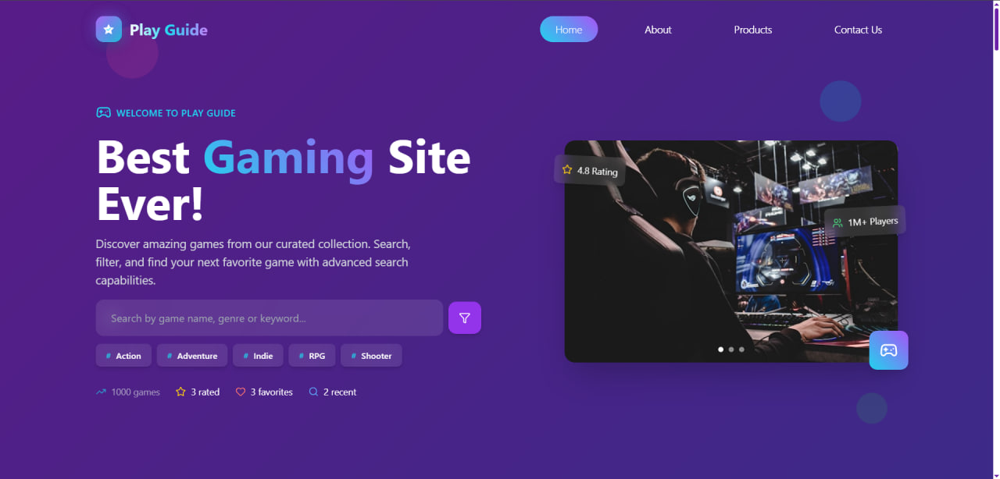

<h1 align="center">🎮 PlayGuide</h1>

<div align="center">

**Game information platform with 1000+ games database**

[](https://react.dev)
[](https://tailwindcss.com)
[](https://rawg.io/apidocs)
[](#)
[](https://opensource.org/licenses/MIT)
[](http://makeapullrequest.com)

[Live Demo](https://playguide-site.vercel.app/) ·
[Report Bug](https://github.com/BilgeGates/Functional_Gaming-Site/issues) ·
[Request Feature](https://github.com/BilgeGates/Functional_Gaming-Site/issues)

</div>

---

## 📖 Table of Contents

- [Overview](#-overview)
- [Features](#-features)
- [Demo Screenshots](#-demo--screenshots)
- [Quick Start](#-quick-start)
- [Project Structure](#-project-structure)
- [Technology Stack](#-technology-stack)
- [Browser Support](#-browser-support)
- [Game Data](#-game-data)
- [Security Privacy](#-security--privacy)
- [Contributing](#-contributing)
- [FAQ](#-faq)
- [License](#-license)

---

## 🌟 Overview

Web application for browsing 1000+ games with ratings, Metacritic scores, and genre information. Built with React and runs entirely in the browser.

---

## ✨ Features

- Browse 1000 games with detailed information
- View ratings, Metacritic scores, and genres
- Add games to favorites
- Rate games and submit reviews
- Search and filter by name, genre, platform
- View game details, screenshots, and statistics
- Viewing history and recently viewed games
- Responsive design

---

## 🖼 Demo & Screenshots

> **Live demo:** https://playguide-site.vercel.app/



## 🚀 Quick Start

### Prerequisites
```bash
Node.js >= 18
npm >= 8
```

### Installation
```bash
# Clone the repository
git clone https://github.com/BilgeGates/Functional_Gaming-Site.git

# Navigate to project directory
cd Functional_Gaming-Site

# Install dependencies
npm install

# Start development server
npm start
```

The application will automatically open at [http://localhost:3000](http://localhost:3000)

### Production Build
```bash
# Create optimized production build
npm run build
```

---

## 📁 Project Structure
```
playguide/
│
├── 📂 public/
│   ├── index.html
│   └── assets/               # Static assets
│
├── 📂 src/
│   │
│   ├── 📂 assets/            # Images, fonts, icons
│   │
│   ├── 📂 components/
│   │   │
│   │   ├── 📂 common/        # Reusable components
│   │   │   ├── Controls.jsx
│   │   │   ├── FavoritesModal.jsx
│   │   │   ├── GameCard.jsx
│   │   │   ├── GameList.jsx
│   │   │   ├── MotionWrapper.jsx
│   │   │   ├── Pagination.jsx
│   │   │   ├── RatingModal.jsx
│   │   │   ├── RatingViewsModal.jsx
│   │   │   ├── RecentViewsModal.jsx
│   │   │   ├── SearchBar.jsx
│   │   │   ├── SearchGameItem.jsx
│   │   │   ├── Stats.jsx
│   │   │   └── index.js
│   │   │
│   │   ├── 📂 sections/      # Section components
│   │   │   │
│   │   │   ├── 📂 CategoriesSection/
│   │   │   │   └── CategoriesSection.jsx
│   │   │   │
│   │   │   ├── 📂 Header/
│   │   │   │   ├── Header.jsx
│   │   │   │   └── HeroSection.jsx
│   │   │   │
│   │   │   ├── 📂 TopRatedSection/
│   │   │   │   └── TopRatedSection.jsx
│   │   │   │
│   │   │   └── 📂 TrendingSection/
│   │   │       └── TrendingSection.jsx
│   │   │
│   │   └── 📂 ui/            # UI components
│   │       ├── ActionButton.jsx
│   │       ├── CardOverlay.jsx
│   │       ├── ErrorMessage.jsx
│   │       ├── ExploreButton.jsx
│   │       ├── GameStats.jsx
│   │       ├── GenreBadge.jsx
│   │       ├── LoadingSpinner.jsx
│   │       ├── MetacriticScore.jsx
│   │       ├── RatingBadge.jsx
│   │       ├── SectionHeader.jsx
│   │       └── index.js
│   │
│   ├── 📂 hooks/             # Custom React hooks
│   │   ├── index.js
│   │   ├── useDocumentTitle.js
│   │   ├── useFavorites.js
│   │   ├── useGameData.js
│   │   ├── useHandlers.js
│   │   ├── useInViewAnimation.js
│   │   ├── useLocalStorage.js
│   │   ├── useLogic.js
│   │   ├── useRating.js
│   │   ├── useRatingViews.js
│   │   ├── useRecentViews.js
│   │   ├── useSearch.js
│   │   ├── useSearchInteractions.js
│   │   ├── useSearchKeyboard.js
│   │   └── useSearchResults.js
│   │
│   ├── 📂 layout/            # Layout components
│   │   ├── 📂 Footer/
│   │   │   └── Footer.jsx
│   │   ├── 📂 Navbar/
│   │   │   └── Navbar.jsx
│   │   └── index.js
│   │
│   ├── 📂 pages/             # Application pages
│   │   ├── 📂 About/
│   │   │   └── About.jsx
│   │   ├── 📂 Contact/
│   │   │   └── Contact.jsx
│   │   ├── 📂 Home/
│   │   │   └── Home.jsx
│   │   ├── 📂 ProductDetails/
│   │   │   └── ProductDetails.jsx
│   │   └── 📂 Products/
│   │       └── Products.jsx
│   │
│   ├── 📂 routes/            # Routing configuration
│   │   └── router.jsx
│   │
│   ├── 📂 utils/             # Utility functions
│   │   ├── dateUtils.js
│   │   ├── formatUtils.js
│   │   ├── iconUtils.js
│   │   ├── searchUtils.js
│   │   └── index.js
│   │
│   ├── App.jsx               # Root component
│   ├── index.js              # Entry point
│   └── index.css             # Global styles
│
├── 📄 db.json                # Game database (1000+ games)
├── 📄 .gitignore
├── 📄 postcss.config.js
├── 📄 tailwind.config.js
├── 📄 package.json
├── 📄 package-lock.json
├── 📄 README.md
├── 📄 CONTRIBUTING.md
├── 📄 CODE_OF_CONDUCT.md
├── 📄 SECURITY.md
└── 📄 LICENSE
```
---

## 🛠️ Technology Stack

### Core Technologies

<table>
<tr>
<td align="center" width="25%">
  <br>
  <b>React 18+</b><br>
  <sub>UI Framework</sub>
</td>

<td align="center" width="25%">
  <br>
  <b>JavaScript ES6+</b><br>
  <sub>Language</sub>
</td>

<td align="center" width="25%">
  <br>
  <b>Tailwind CSS 3.x</b><br>
  <sub>Styling</sub>
</td>

<td align="center" width="25%">
  <br>
  <b>Node.js 18+</b><br>
  <sub>Runtime</sub>
</td>
</tr>
</table>

### Additional Libraries

- **React Router** - Client-side routing
- **localStorage** - User data persistence
- **RAWG API** - Game data source (pre-fetched)

---

## 🌐 Browser Support

<div align="center">

| Browser | Version | Status |
|---------|---------|--------|
|  Chrome | 90+ | ✅ Tested |
|  Firefox | 88+ | ✅ Tested |
|  Safari | 14+ | ✅ Expected to work |
|  Edge | 90+ | ✅ Expected to work |
|  Opera | 76+ | ✅ Expected to work |

</div>

### Required Browser Features

- ES6+ JavaScript
- CSS Grid & Flexbox
- localStorage API
- Responsive viewport support

---

## 🎮 Game Data

PlayGuide stores all game data locally in `db.json`. This data was originally sourced from the RAWG API and includes:

### Data Structure
```javascript
{
  id: Number,                    // Unique game ID
  name: String,                  // Game title
  slug: String,                  // URL-friendly name
  released: String,              // Release date (YYYY-MM-DD)
  background_image: String,      // Main image URL
  rating: Number,                // Average rating (0-5)
  rating_top: Number,            // Top rating value
  ratings_count: Number,         // Number of ratings
  metacritic: Number,            // Metacritic score (0-100)
  playtime: Number,              // Average playtime (hours)
  genres: Array                  // Array of genre objects
}
```

### Data Features

- 1000+ pre-loaded games
- Ratings and Metacritic scores
- Multiple genres per game
- Release dates and playtime statistics

### Data Attribution

RAWG API data is used for educational and non-commercial purposes only.

---

## 🔐 Security & Privacy

Zero-backend architecture - all functionality runs in the browser.

### 🔒 Security Highlights

- ✅ No server-side data storage
- ✅ Client-side processing only
- ✅ No cookies, trackers, or fingerprinting
- ✅ No third-party analytics or telemetry
- ✅ No user data is collected, stored, or transmitted

### 🛡️ Data Safety

All favorites, ratings, and viewing history are stored locally using localStorage.

For security concerns, see [SECURITY.md](SECURITY.md).

---

## 🤝 Contributing

Contributions welcome.

### Quick Contribution Guide
```bash
# 1. Fork the repository
# 2. Create your feature branch
git checkout -b feature/amazing-feature

# 3. Commit your changes
git commit -m 'feat: add amazing feature'

# 4. Push to the branch
git push origin feature/amazing-feature

# 5. Open a Pull Request
```

Please read [CONTRIBUTING.md](CONTRIBUTING.md) for detailed guidelines on:
- Code standards and best practices
- Pull request process
- Bug reporting
- Feature requests

### Code of Conduct

This project adheres to the Contributor Covenant [Code of Conduct](CODE_OF_CONDUCT.md). By participating, you are expected to uphold this code.

### Contributors

<a href="https://github.com/BilgeGates/Functional_Gaming-Site/graphs/contributors">
  
</a>

---

## 📝 License

This project is licensed under the **MIT License** - see the [LICENSE](LICENSE) file for details.
```
MIT License

Copyright (c) 2026 Khatai Huseynzada

Permission is hereby granted, free of charge, to any person obtaining a copy
of this software and associated documentation files (the "Software"), to deal
in the Software without restriction, including without limitation the rights
to use, copy, modify, merge, publish, distribute, sublicense, and/or sell
copies of the Software, and to permit persons to whom the Software is
furnished to do so, subject to the following conditions:

The above copyright notice and this permission notice shall be included in all
copies or substantial portions of the Software.

THE SOFTWARE IS PROVIDED "AS IS", WITHOUT WARRANTY OF ANY KIND, EXPRESS OR
IMPLIED, INCLUDING BUT NOT LIMITED TO THE WARRANTIES OF MERCHANTABILITY,
FITNESS FOR A PARTICULAR PURPOSE AND NONINFRINGEMENT. IN NO EVENT SHALL THE
AUTHORS OR COPYRIGHT HOLDERS BE LIABLE FOR ANY CLAIM, DAMAGES OR OTHER
LIABILITY, WHETHER IN AN ACTION OF CONTRACT, TORT OR OTHERWISE, ARISING FROM,
OUT OF OR IN CONNECTION WITH THE SOFTWARE OR THE USE OR OTHER DEALINGS IN THE
SOFTWARE.
```

---

## 👨‍💻 Author

<div align="center">

### Khatai Huseynzada

**Front-End Web Developer | Open Source Contributor**

[](https://github.com/BilgeGates)
[](https://linkedin.com/in/khatai-huseynzada)
[](mailto:darkdeveloperassistant@gmail.com)

</div>

---

## 🙏 Acknowledgments

<table>
<tr>
<td align="center" width="33%">
  <br>
  <b>React Team</b><br>
  <sub>Framework</sub>
</td>
  
<td align="center" width="33%">
  <br>
  <b>Tailwind Labs</b><br>
  <sub>CSS Framework</sub>
</td>

<td align="center" width="33%">
  <b>RAWG API</b><br>
  <sub>Game Database</sub>
</td>
</tr>
</table>

---

## 📧 Community & Support

<div align="center">

| Channel | Link |
|---------|------|
| 🐛 **Bug Reports** | [GitHub Issues](https://github.com/BilgeGates/Functional_Gaming-Site/issues) |
| 💡 **Feature Requests** | [GitHub Discussions](https://github.com/BilgeGates/Functional_Gaming-Site/discussions) |
| 📧 **Email** | darkdeveloperassistant@gmail.com |

*Responses on a best-effort basis*

</div>

---

## ❓ FAQ

<details>
<summary><b>How do I report a bug?</b></summary>

1. Check if the issue already exists in [GitHub Issues](https://github.com/BilgeGates/Functional_Gaming-Site/issues)
2. If not, create a new issue with:
   - Clear description of the problem
   - Steps to reproduce
   - Expected vs actual behavior
   - Screenshots (if applicable)
   - Browser and OS information
</details>

<details>
<summary><b>Can I use this commercially?</b></summary>

Yes! The source code is MIT licensed and can be used commercially.  
However, game data originally sourced from the RAWG API is intended for educational and non-commercial use only. If you plan to use this project commercially, you must replace the data source with a licensed provider.
</details>

<details>
<summary><b>How do I add more games?</b></summary>

1. Games are stored in `db.json`
2. Follow the existing data structure
3. Add new game objects to the array
4. Submit a pull request with your changes
</details>

<details>
<summary><b>Where does the game data come from?</b></summary>

Game data was originally sourced from the RAWG API and is now maintained locally in `db.json`.  
The application does not fetch data at runtime.
</details>

<details>
<summary><b>How is my data stored?</b></summary>

All user data (favorites, ratings, viewing history) is stored locally in your browser using localStorage.  
No data is sent to any server.
</details>

---

**© 2026 Khatai Huseynzada. Licensed under MIT.**
